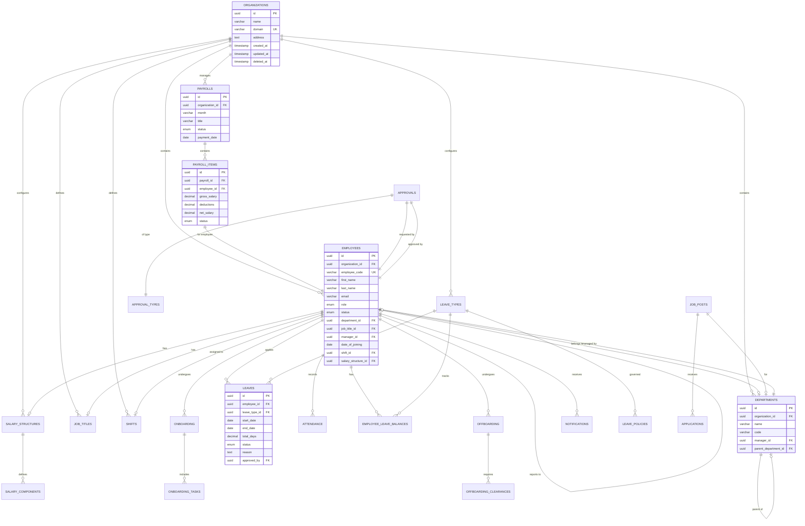
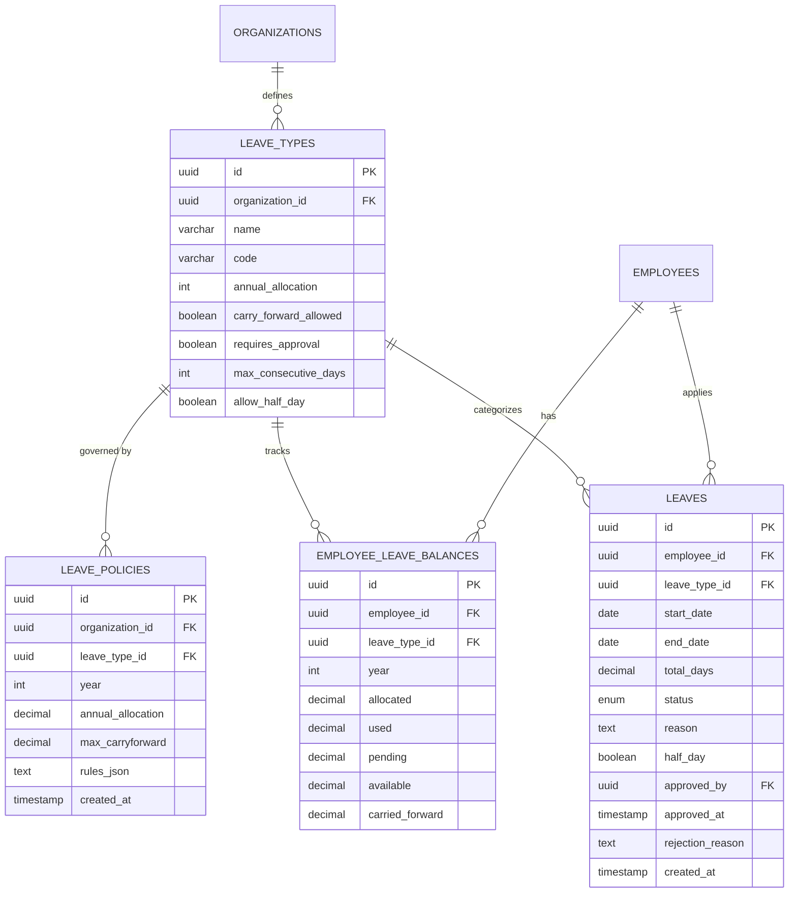
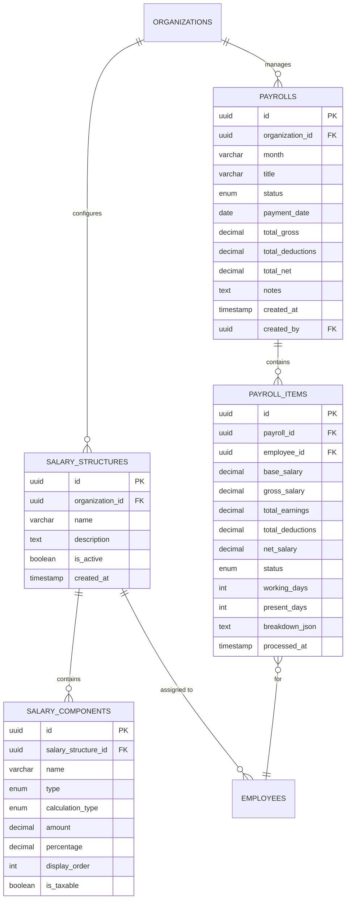
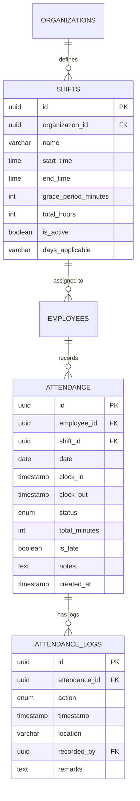
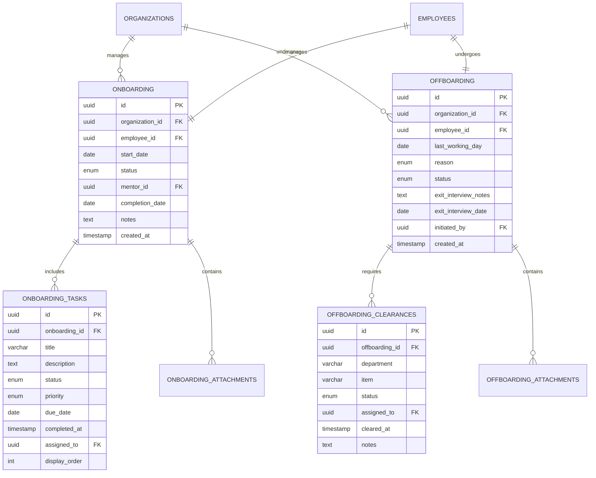
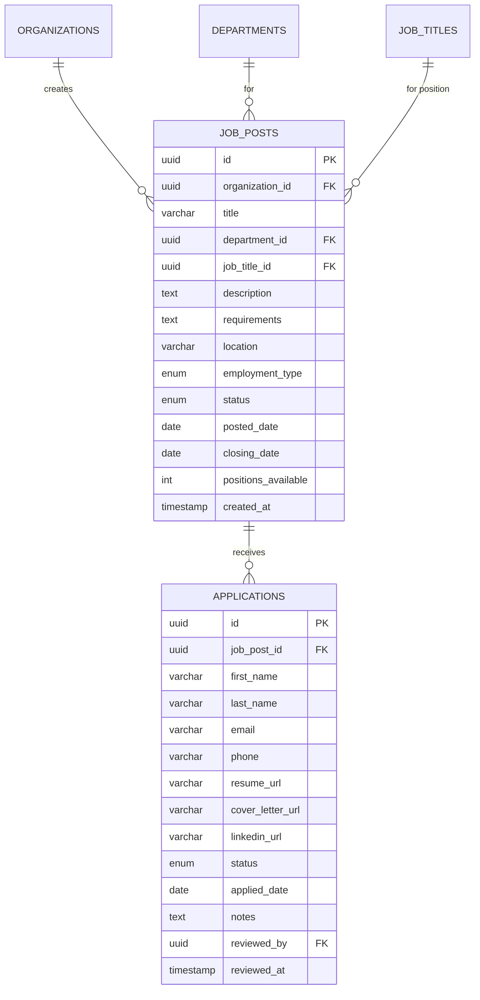
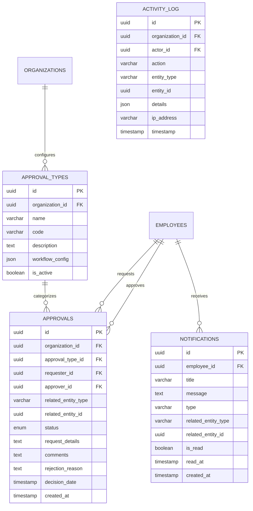

# Database Schema Diagram

## Core Entity Relationships



## Leave Management Schema



## Payroll Schema



## Attendance & Shift Schema



## Onboarding & Offboarding Schema



## Recruitment Schema



## Approvals & Notifications Schema



## Core Entity Details

### Organization Entity (Root)
```
organizations
├─ id (PK, UUID)
├─ name (VARCHAR)
├─ domain (VARCHAR, UNIQUE)
├─ address (TEXT)
├─ created_at (TIMESTAMP)
├─ updated_at (TIMESTAMP)
└─ deleted_at (TIMESTAMP, nullable)
```

### Employee Entity (Central)
```
employees
├─ id (PK, UUID)
├─ organization_id (FK → organizations)
├─ employee_code (VARCHAR, UNIQUE)
├─ first_name (VARCHAR)
├─ last_name (VARCHAR)
├─ email (VARCHAR)
├─ display_name (VARCHAR)
├─ role (ENUM: employee, manager, hr_manager, admin)
├─ status (ENUM: active, inactive, on_leave, terminated)
├─ department_id (FK → departments)
├─ job_title_id (FK → job_titles)
├─ manager_id (FK → employees, self-reference)
├─ date_of_joining (DATE)
├─ date_of_birth (DATE)
├─ employment_type (ENUM: full_time, part_time, contract)
├─ phone (VARCHAR)
├─ address (TEXT)
├─ shift_id (FK → shifts)
├─ salary_structure_id (FK → salary_structures)
└─ ... (more profile fields)
```

### Department Entity
```
departments
├─ id (PK, UUID)
├─ organization_id (FK → organizations)
├─ name (VARCHAR)
├─ code (VARCHAR)
├─ manager_id (FK → employees)
└─ parent_department_id (FK → departments, for hierarchy)
```

### Leave Management
```
leave_types
├─ id (PK, UUID)
├─ organization_id (FK → organizations)
├─ name (VARCHAR)
├─ code (VARCHAR)
├─ annual_allocation (INT)
├─ carry_forward_allowed (BOOLEAN)
└─ requires_approval (BOOLEAN)

leave_policies
├─ id (PK, UUID)
├─ organization_id (FK → organizations)
├─ leave_type_id (FK → leave_types)
└─ ... (policy rules)

employee_leave_balances
├─ id (PK, UUID)
├─ employee_id (FK → employees)
├─ leave_type_id (FK → leave_types)
├─ year (INT)
├─ allocated (DECIMAL)
├─ used (DECIMAL)
├─ pending (DECIMAL)
└─ available (DECIMAL)

leaves
├─ id (PK, UUID)
├─ employee_id (FK → employees)
├─ leave_type_id (FK → leave_types)
├─ start_date (DATE)
├─ end_date (DATE)
├─ total_days (DECIMAL)
├─ status (ENUM: pending, approved, rejected, cancelled)
├─ reason (TEXT)
└─ approved_by (FK → employees)
```

### Attendance
```
shifts
├─ id (PK, UUID)
├─ organization_id (FK → organizations)
├─ name (VARCHAR)
├─ start_time (TIME)
├─ end_time (TIME)
└─ grace_period_minutes (INT)

attendance
├─ id (PK, UUID)
├─ employee_id (FK → employees)
├─ shift_id (FK → shifts)
├─ date (DATE)
├─ clock_in (TIMESTAMP)
├─ clock_out (TIMESTAMP)
├─ status (ENUM: present, absent, late, half_day)
└─ ... (additional fields)

attendance_logs
├─ id (PK, UUID)
├─ attendance_id (FK → attendance)
├─ action (ENUM: clock_in, clock_out, edit)
├─ timestamp (TIMESTAMP)
└─ location (VARCHAR)
```

### Payroll
```
salary_structures
├─ id (PK, UUID)
├─ organization_id (FK → organizations)
├─ name (VARCHAR)
└─ ... (structure details)

salary_components
├─ id (PK, UUID)
├─ salary_structure_id (FK → salary_structures)
├─ name (VARCHAR)
├─ type (ENUM: earning, deduction)
├─ calculation_type (ENUM: fixed, percentage)
└─ amount (DECIMAL)

payrolls
├─ id (PK, UUID)
├─ organization_id (FK → organizations)
├─ month (VARCHAR) // YYYY-MM format
├─ title (VARCHAR)
├─ status (ENUM: draft, posted, processing, paid)
├─ payment_date (DATE)
└─ ... (metadata)

payroll_items
├─ id (PK, UUID)
├─ payroll_id (FK → payrolls)
├─ employee_id (FK → employees)
├─ gross_salary (DECIMAL)
├─ deductions (DECIMAL)
├─ net_salary (DECIMAL)
├─ status (ENUM: pending, paid, on_hold)
└─ ... (itemized breakdown)
```

### Onboarding & Offboarding
```
onboarding
├─ id (PK, UUID)
├─ organization_id (FK → organizations)
├─ employee_id (FK → employees)
├─ start_date (DATE)
├─ status (ENUM: pending, in_progress, completed, cancelled)
├─ mentor_id (FK → employees)
└─ completion_date (DATE)

onboarding_tasks
├─ id (PK, UUID)
├─ onboarding_id (FK → onboarding)
├─ title (VARCHAR)
├─ description (TEXT)
├─ status (ENUM: pending, in_progress, completed)
├─ due_date (DATE)
└─ completed_at (TIMESTAMP)

offboarding
├─ id (PK, UUID)
├─ organization_id (FK → organizations)
├─ employee_id (FK → employees)
├─ last_working_day (DATE)
├─ reason (ENUM: resignation, termination, retirement)
└─ status (ENUM: initiated, in_progress, completed)

offboarding_clearances
├─ id (PK, UUID)
├─ offboarding_id (FK → offboarding)
├─ department (VARCHAR)
├─ item (VARCHAR)
├─ assigned_to (FK → employees)
└─ status (ENUM: pending, cleared)
```

### Recruitment
```
job_posts
├─ id (PK, UUID)
├─ organization_id (FK → organizations)
├─ title (VARCHAR)
├─ department_id (FK → departments)
├─ job_title_id (FK → job_titles)
├─ description (TEXT)
├─ requirements (TEXT)
├─ location (VARCHAR)
├─ type (ENUM: full_time, part_time, contract)
├─ status (ENUM: draft, published, closed)
└─ posted_date (DATE)

applications
├─ id (PK, UUID)
├─ job_post_id (FK → job_posts)
├─ first_name (VARCHAR)
├─ last_name (VARCHAR)
├─ email (VARCHAR)
├─ phone (VARCHAR)
├─ resume_url (VARCHAR)
├─ status (ENUM: received, screening, interview, offered, rejected)
└─ applied_date (DATE)
```

### Approvals & Notifications
```
approval_types
├─ id (PK, UUID)
├─ organization_id (FK → organizations)
├─ name (VARCHAR)
└─ workflow_config (JSON)

approvals
├─ id (PK, UUID)
├─ organization_id (FK → organizations)
├─ approval_type_id (FK → approval_types)
├─ requester_id (FK → employees)
├─ approver_id (FK → employees)
├─ related_entity_type (VARCHAR)
├─ related_entity_id (UUID)
├─ status (ENUM: pending, approved, rejected)
└─ decision_date (TIMESTAMP)

notifications
├─ id (PK, UUID)
├─ employee_id (FK → employees)
├─ title (VARCHAR)
├─ message (TEXT)
├─ type (VARCHAR)
├─ is_read (BOOLEAN)
└─ created_at (TIMESTAMP)

activity_log
├─ id (PK, UUID)
├─ organization_id (FK → organizations)
├─ actor_id (FK → employees)
├─ action (VARCHAR)
├─ entity_type (VARCHAR)
├─ entity_id (UUID)
├─ details (JSON)
└─ timestamp (TIMESTAMP)
```

### Job Titles
```
job_titles
├─ id (PK, UUID)
├─ organization_id (FK → organizations)
├─ title (VARCHAR)
├─ level (INT)
└─ description (TEXT)
```

### Documents
```
employee_documents
├─ id (PK, UUID)
├─ employee_id (FK → employees)
├─ document_type (VARCHAR)
├─ file_url (VARCHAR)
├─ uploaded_at (TIMESTAMP)
└─ uploaded_by (FK → employees)
```

## Relationship Types:

- **One-to-Many**: Organization → Employees, Department → Employees
- **Many-to-One**: Employee → Department, Employee → Manager
- **Self-Referencing**: Employee → Manager (both are employees)
- **Optional Relationships**: Employee → Shift (nullable)

## Key Indexes:

- `employees.employee_code` (UNIQUE)
- `employees.organization_id` (for multi-tenant queries)
- `leaves.employee_id, leaves.start_date`
- `attendance.employee_id, attendance.date`
- `payroll_items.payroll_id, payroll_items.employee_id`
- `organizations.domain` (UNIQUE)

## Design Notes:

1. All entities have `organization_id` for multi-tenancy (except Organization itself)
2. Most entities include `created_at`, `updated_at` timestamps
3. Some entities support soft deletes with `deleted_at`
4. Foreign key constraints enforce referential integrity
5. Indexes are critical for query performance at scale
6. UUID primary keys provide globally unique identifiers
7. ENUM types ensure data consistency for status fields
