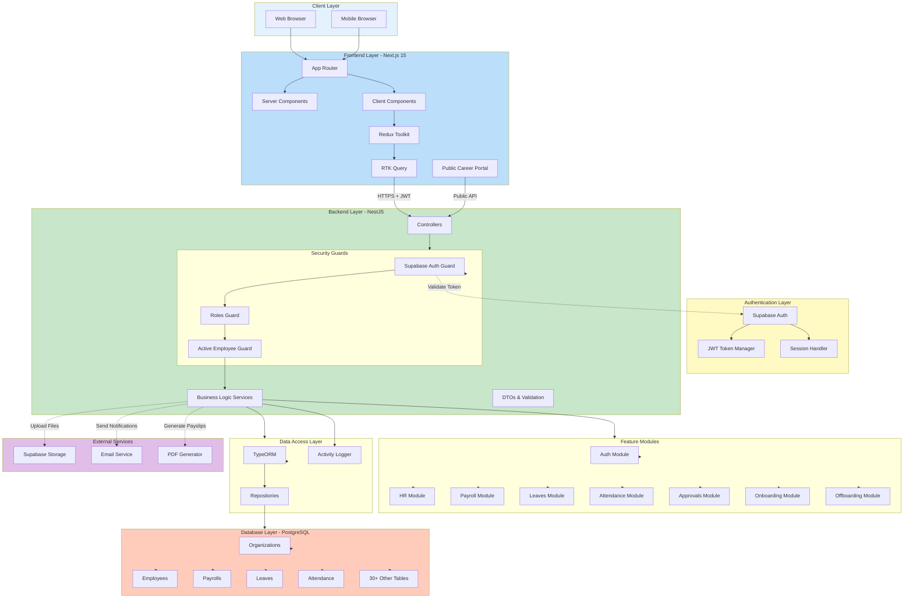
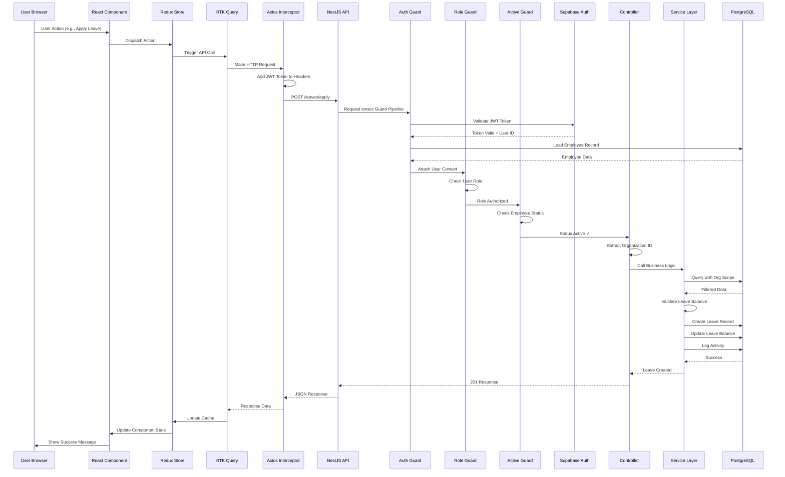
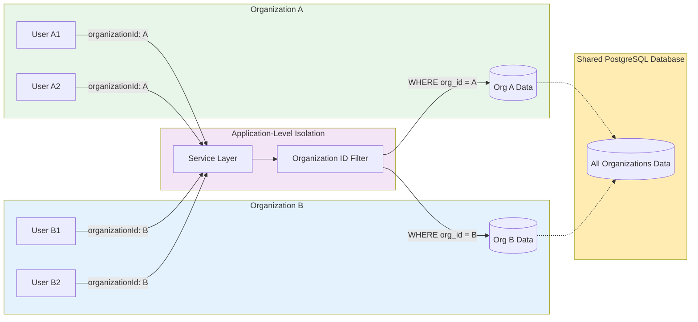
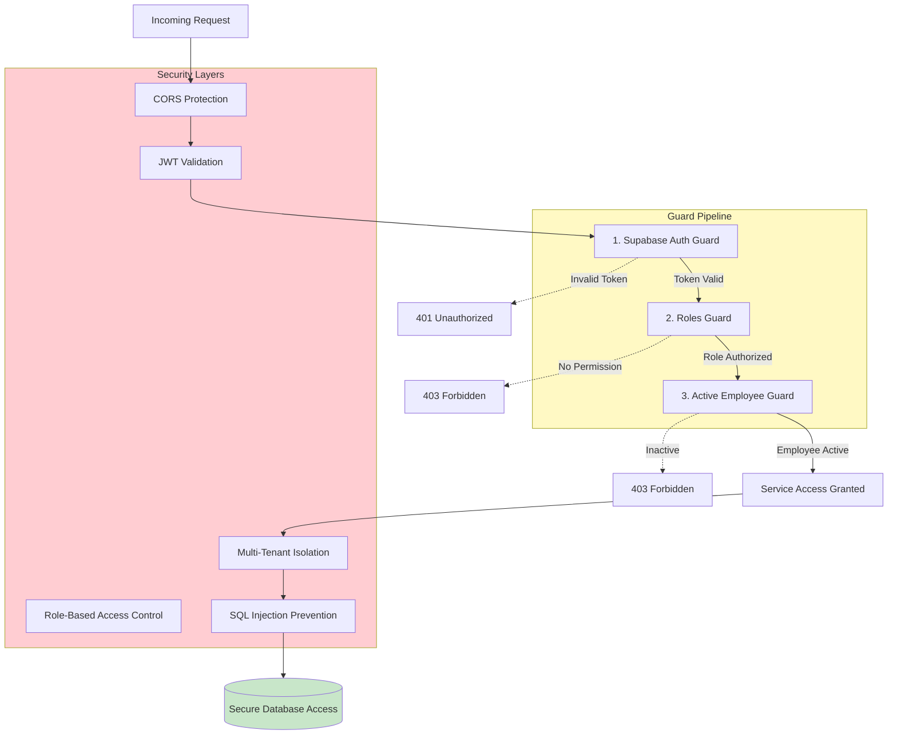
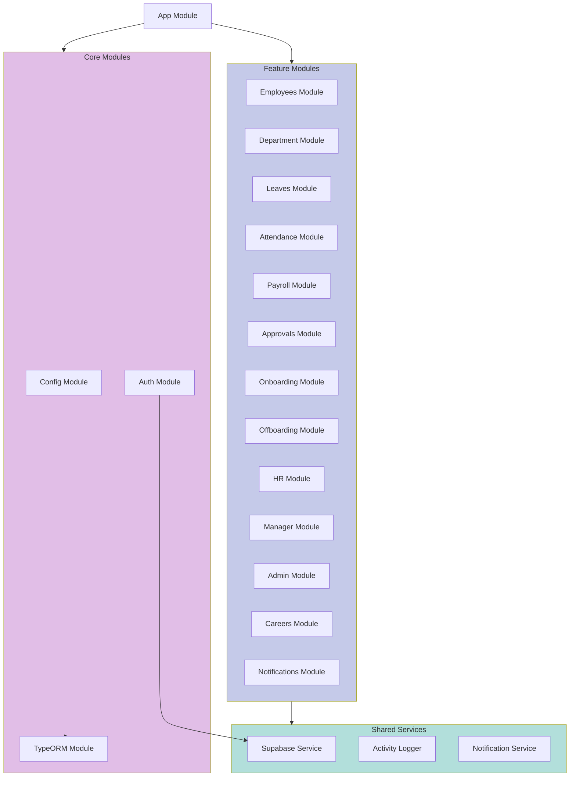

# System Architecture Diagram

## Overview Architecture

```mermaid
graph TB
    subgraph Client["Client Layer"]
        Browser[Web Browser]
        Mobile[Mobile Browser]
    end

    subgraph Frontend["Frontend Layer - Next.js 15"]
        AppRouter[App Router]
        ServerComp[Server Components]
        ClientComp[Client Components]
        Redux[Redux Toolkit]
        RTKQuery[RTK Query]
        PublicPages[Public Career Portal]
    end

    subgraph Auth["Authentication Layer"]
        SupabaseAuth[Supabase Auth]
        JWT[JWT Token Manager]
        SessionMgr[Session Handler]
    end

    subgraph Backend["Backend Layer - NestJS"]
        Guards[Guard Pipeline]
        Controllers[Controllers]
        Services[Business Logic Services]
        DTOs[DTOs & Validation]
    end

    subgraph Guards["Security Guards"]
        AuthGuard[Supabase Auth Guard]
        RoleGuard[Roles Guard]
        ActiveGuard[Active Employee Guard]
    end

    subgraph Modules["Feature Modules"]
        AuthMod[Auth Module]
        HRMod[HR Module]
        PayrollMod[Payroll Module]
        LeavesMod[Leaves Module]
        AttendMod[Attendance Module]
        ApprovalsMod[Approvals Module]
        OnboardMod[Onboarding Module]
        OffboardMod[Offboarding Module]
    end

    subgraph Data["Data Access Layer"]
        TypeORM[TypeORM]
        Repos[Repositories]
        ActivityLog[Activity Logger]
    end

    subgraph Database["Database Layer - PostgreSQL"]
        OrgTable[Organizations]
        EmpTable[Employees]
        PayrollTable[Payrolls]
        LeaveTable[Leaves]
        AttendTable[Attendance]
        OtherTables[30+ Other Tables]
    end

    subgraph External["External Services"]
        SupabaseStorage[Supabase Storage]
        EmailSvc[Email Service]
        PDFGen[PDF Generator]
    end

    Browser --> AppRouter
    Mobile --> AppRouter
    AppRouter --> ServerComp
    AppRouter --> ClientComp
    ClientComp --> Redux
    Redux --> RTKQuery
    RTKQuery -->|HTTPS + JWT| Controllers
    PublicPages -->|Public API| Controllers

    Controllers --> Guards
    Guards --> AuthGuard
    AuthGuard --> RoleGuard
    RoleGuard --> ActiveGuard
    ActiveGuard --> Services

    Services --> Modules
    Modules --> AuthMod
    Modules --> HRMod
    Modules --> PayrollMod
    Modules --> LeavesMod
    Modules --> AttendMod
    Modules --> ApprovalsMod
    Modules --> OnboardMod
    Modules --> OffboardMod

    Services --> Data
    Data --> TypeORM
    TypeORM --> Repos
    Services --> ActivityLog

    Repos --> Database
    Database --> OrgTable
    Database --> EmpTable
    Database --> PayrollTable
    Database --> LeaveTable
    Database --> AttendTable
    Database --> OtherTables

    AuthGuard -.->|Validate Token| SupabaseAuth
    SupabaseAuth --> JWT
    SupabaseAuth --> SessionMgr

    Services -.->|Upload Files| SupabaseStorage
    Services -.->|Send Notifications| EmailSvc
    Services -.->|Generate Payslips| PDFGen

    style Client fill:#e3f2fd
    style Frontend fill:#bbdefb
    style Auth fill:#fff9c4
    style Backend fill:#c8e6c9
    style Database fill:#ffccbc
    style External fill:#e1bee7
```

## Detailed Request Flow

```mermaid
sequenceDiagram
    participant User as User Browser
    participant UI as React Component
    participant Redux as Redux Store
    participant RTK as RTK Query
    participant Axios as Axios Interceptor
    participant API as NestJS API
    participant Guard1 as Auth Guard
    participant Guard2 as Role Guard
    participant Guard3 as Active Guard
    participant Supabase as Supabase Auth
    participant Controller as Controller
    participant Service as Service Layer
    participant DB as PostgreSQL

    User->>UI: User Action (e.g., Apply Leave)
    UI->>Redux: Dispatch Action
    Redux->>RTK: Trigger API Call
    RTK->>Axios: Make HTTP Request
    Axios->>Axios: Add JWT Token to Headers
    Axios->>API: POST /leaves/apply
    
    API->>Guard1: Request enters Guard Pipeline
    Guard1->>Supabase: Validate JWT Token
    Supabase-->>Guard1: Token Valid + User ID
    Guard1->>DB: Load Employee Record
    DB-->>Guard1: Employee Data
    Guard1->>Guard2: Attach User Context
    
    Guard2->>Guard2: Check User Role
    Guard2->>Guard3: Role Authorized
    
    Guard3->>Guard3: Check Employee Status
    Guard3->>Controller: Status Active ✓
    
    Controller->>Controller: Extract Organization ID
    Controller->>Service: Call Business Logic
    Service->>DB: Query with Org Scope
    DB-->>Service: Filtered Data
    Service->>Service: Validate Leave Balance
    Service->>DB: Create Leave Record
    Service->>DB: Update Leave Balance
    Service->>DB: Log Activity
    DB-->>Service: Success
    
    Service-->>Controller: Leave Created
    Controller-->>API: 201 Response
    API-->>Axios: JSON Response
    Axios-->>RTK: Response Data
    RTK->>Redux: Update Cache
    Redux->>UI: Update Component State
    UI->>User: Show Success Message
```

## Multi-Tenant Architecture

```mermaid
graph LR
    subgraph Org1["Organization A"]
        User1[User A1]
        User2[User A2]
        Data1[(Org A Data)]
    end

    subgraph Org2["Organization B"]
        User3[User B1]
        User4[User B2]
        Data2[(Org B Data)]
    end

    subgraph SharedDB["Shared PostgreSQL Database"]
        AllData[(All Organizations Data)]
    end

    subgraph AppLevel["Application-Level Isolation"]
        OrgFilter[Organization ID Filter]
        ServiceLayer[Service Layer]
    end

    User1 -->|organizationId: A| ServiceLayer
    User2 -->|organizationId: A| ServiceLayer
    User3 -->|organizationId: B| ServiceLayer
    User4 -->|organizationId: B| ServiceLayer

    ServiceLayer --> OrgFilter
    OrgFilter -->|WHERE org_id = A| Data1
    OrgFilter -->|WHERE org_id = B| Data2
    Data1 -.-> AllData
    Data2 -.-> AllData

    style Org1 fill:#e8f5e9
    style Org2 fill:#e3f2fd
    style SharedDB fill:#ffecb3
    style AppLevel fill:#f3e5f5
```

## Security Architecture

```mermaid
graph TB
    subgraph SecurityLayers["Security Layers"]
        CORS[CORS Protection]
        JWT[JWT Validation]
        RBAC[Role-Based Access Control]
        DataIsolation[Multi-Tenant Isolation]
        ORM[SQL Injection Prevention]
    end

    subgraph GuardPipeline["Guard Pipeline"]
        Step1[1. Supabase Auth Guard]
        Step2[2. Roles Guard]
        Step3[3. Active Employee Guard]
    end

    Request[Incoming Request] --> CORS
    CORS --> JWT
    JWT --> Step1
    Step1 -->|Token Valid| Step2
    Step2 -->|Role Authorized| Step3
    Step3 -->|Employee Active| ServiceAccess[Service Access Granted]
    
    ServiceAccess --> DataIsolation
    DataIsolation --> ORM
    ORM --> Database[(Secure Database Access)]

    Step1 -.->|Invalid Token| Reject1[401 Unauthorized]
    Step2 -.->|No Permission| Reject2[403 Forbidden]
    Step3 -.->|Inactive| Reject3[403 Forbidden]

    style SecurityLayers fill:#ffcdd2
    style GuardPipeline fill:#fff9c4
    style Database fill:#c8e6c9
```

## Module Architecture

```mermaid
graph TB
    subgraph CoreModules["Core Modules"]
        Config[Config Module]
        AuthModule[Auth Module]
        DB[TypeORM Module]
    end

    subgraph FeatureModules["Feature Modules"]
        Employees[Employees Module]
        Departments[Department Module]
        Leaves[Leaves Module]
        Attendance[Attendance Module]
        Payroll[Payroll Module]
        Approvals[Approvals Module]
        Onboarding[Onboarding Module]
        Offboarding[Offboarding Module]
        HR[HR Module]
        Manager[Manager Module]
        Admin[Admin Module]
        Careers[Careers Module]
        Notifications[Notifications Module]
    end

    subgraph SharedServices["Shared Services"]
        Supabase[Supabase Service]
        ActivityLogger[Activity Logger]
        NotificationSvc[Notification Service]
    end

    AppModule[App Module] --> CoreModules
    AppModule --> FeatureModules
    
    FeatureModules --> SharedServices
    CoreModules --> DB
    AuthModule --> Supabase

    style CoreModules fill:#e1bee7
    style FeatureModules fill:#c5cae9
    style SharedServices fill:#b2dfdb
```
